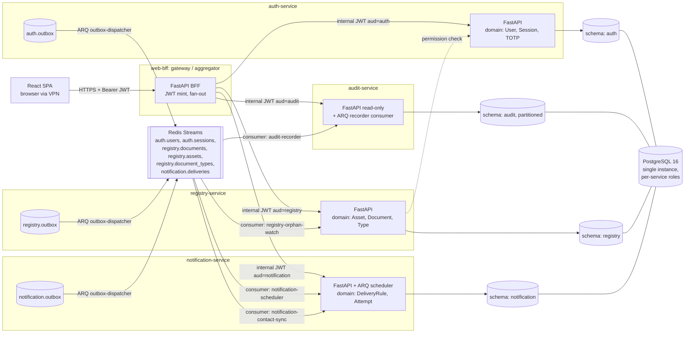
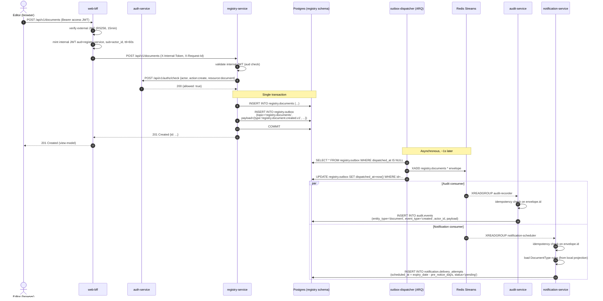

# ADR-0002: Service Boundaries and Inter-Service Contracts

- **Status**: Accepted
- **Date**: 2026-05-06
- **Accepted on**: 2026-05-06
- **Deciders**: architect (proposed), venawaziwoco83@gmail.com (accepted)
- **Depends on**: ADR-0001 (Tech Stack Selection)

## Acceptance addendum (2026-05-06)

The five GATE-1 open questions were resolved as follows. These are binding for implementation:

| # | Question | Decision |
|---|---|---|
| 1 | `registry → auth` permission check now, or BFF-only authz from JWT claims? | **BFF-only on day one.** Remove the single backend↔backend sync edge. Authorization decisions are made by `web-bff` based on the role + scopes already in the access JWT. The call graph becomes a pure star. Revisit if RBAC requires per-resource ACLs (separate ADR). |
| 2 | System-actor identity in audit events — null UUID, or named UUIDv7 per system actor? | **Named UUIDv7 constants per system actor.** Three reserved IDs at minimum: `outbox-dispatcher`, `notification-scheduler`, `audit-recorder`. Constants live in the shared kernel under `lotsman_shared.actors`. Audit history must be able to distinguish system actions for incident triage. |
| 3 | Redis Streams retention | **14 days** (`MAXLEN ~` trim policy per stream). Operational shelf only; long-term history lives in `audit.events` partitions. Memory budget on Redis stays predictable. |
| 4 | Shared kernel scope | **Minimum.** Only `UserId`, `RequestId`, the event envelope, the internal-JWT verifier, and the system-actor UUID constants. No `Money`, `DateRange`, or pagination DTOs in the shared kernel — duplication is cheaper than wrong coupling. |
| 5 | Monorepo vs per-service repos | **Monorepo.** Path: `services/<name>/` for backends, `web/` for SPA, `infra/` for ops, `shared/` for the shared kernel package. One PR can atomically cross service boundaries. |

The body of this ADR (sections A–H) is updated only where these decisions contradict the original draft (notably: §B removes the `registry → auth` row).

## Context

ADR-0001 fixed the technology stack and named five top-level deployment units for Лоцман: `auth-service`, `registry-service`, `notification-service`, `audit-service`, and `web-bff`. It did **not** define what each service actually owns, what it is forbidden to touch, how services talk to each other, or how identity is propagated across the wire. Without that contract written down before any code is generated, four `backend` invocations will independently invent four mutually inconsistent boundaries — exactly the failure mode that turned the legacy Excel registry into a maintenance burden.

The forces at play:

- **Tiny user base, audit-heavy workload.** 2–4 concurrent users, but every state change must produce an immutable audit record and may produce notifications across three channels (email, Telegram, Dion). The system is read-light and event-rich.
- **On-prem, single Postgres instance.** Per ADR-0001 we deploy via Docker Compose on one host, with logical schema separation rather than physical DB-per-service. This permits "fake-microservice" temptations (cross-schema joins, shared DB sessions) that we must explicitly forbid now.
- **Database-engineer has already sketched per-service Postgres schemas** (`auth`, `registry`, `notification`, `audit`) with no cross-schema FKs and an outbox-table convention. Service boundaries must align 1-to-1 with those schemas.
- **No service mesh on day one.** Internal traffic is plain HTTP between Compose-network containers. mTLS is deferred to ADR-0005. Cross-service authorization therefore relies on signed internal JWTs.
- **Async backbone is Redis Streams**, not Kafka — per ADR-0001's "lightweight" stance. We need a versioned envelope and clear stream-naming so the system stays legible at four services and growable to six without re-architecting.

This ADR formalizes ownership, sync contracts, async contracts, identity propagation, and the things we are explicitly **not** splitting.

## Decision

We adopt **four bounded-context backend services plus one BFF gateway**, each owning a single Postgres schema and a small set of Redis Streams topics. Every service writes to its own schema only and exposes its data to other services via (a) a versioned HTTP API for synchronous reads/commands, and (b) a transactional-outbox-driven event stream for asynchronous integration. The `web-bff` is the **only** caller that fans out across services in a single user request; backend services may not initiate calls back into the registry, and they consume each other's data exclusively through events. Identity is propagated by `web-bff` re-signing the user's access JWT into a short-TTL **internal JWT** addressed (`aud` claim) to the target service.

## A. Ownership matrix

| Service | Postgres schema(s) it exclusively writes | Domain entities it owns | Events it publishes | Events it consumes |
|---|---|---|---|---|
| `auth-service` | `auth` | `User`, `Role`, `TotpSecret`, `Session`, `RefreshToken`, `LoginAttempt` | `auth.user.created.v1`, `auth.user.updated.v1`, `auth.user.deactivated.v1`, `auth.user.role_changed.v1`, `auth.session.revoked.v1` | (none — root of identity) |
| `registry-service` | `registry` | `Asset` (партнёрская компания), `DocumentType`, `Document`, `AttachmentMetadata`, `ExportJob` | `registry.document.created.v1`, `registry.document.updated.v1`, `registry.document.archived.v1`, `registry.document.deleted.v1`, `registry.asset.created.v1`, `registry.asset.updated.v1`, `registry.document_type.upserted.v1` | `auth.user.deactivated.v1` (to flag orphaned `responsible_user_id`) |
| `notification-service` | `notification` | `DeliveryRule`, `DeliveryAttempt`, `MessageTemplate`, `ProviderCredential` (encrypted), `RetryPolicy` | `notification.delivery.scheduled.v1`, `notification.delivery.sent.v1`, `notification.delivery.failed.v1` | `registry.document.created.v1`, `registry.document.updated.v1`, `registry.document.archived.v1`, `auth.user.deactivated.v1`, `auth.user.updated.v1` (contact channels) |
| `audit-service` | `audit` | `AuditEvent` (append-only, monthly RANGE partitions) | (none — terminal sink) | **all** `*.v1` events from every other service (subscribes with `$` consumer group `audit-recorder`) |
| `web-bff` | (no schema; stateless aside from short-lived Redis session keys) | (no domain entities; only DTOs and view-models) | (none) | (none — direct HTTP only) |

Hard rules derived from the matrix:

1. No service may open a SQLAlchemy session against another service's schema. CI enforces this with `import-linter` (forbid `from auth.infrastructure...` inside `registry/`, etc.) and at runtime via per-service Postgres roles whose `search_path` and grants are limited to the owning schema.
2. There are no foreign keys across schemas. Cross-context references (e.g., `registry.documents.responsible_user_id`) are stored as bare UUIDs with a comment naming the logical referent; integrity is maintained by application-layer validation and by `auth.user.deactivated.v1` consumers.
3. `audit-service` is the only consumer permitted to subscribe to **every** stream. Other services subscribe only to events explicitly listed in the matrix.

## B. Synchronous (HTTP) contracts

All synchronous calls are FastAPI HTTP under `/api/v1/...`, JSON bodies, OpenAPI 3.1 contract committed to `docs/api/<service>.yaml`, generated from the FastAPI app.

**Permitted call graph:**

| Caller | Callee | Purpose | Example endpoints |
|---|---|---|---|
| `web-bff` | `auth-service` | Login, TOTP verify, refresh, list users (admin), profile | `POST /api/v1/auth/login`, `POST /api/v1/auth/totp/verify`, `POST /api/v1/auth/refresh`, `GET /api/v1/users/me`, `GET /api/v1/users` |
| `web-bff` | `registry-service` | All CRUD for assets, documents, types; export; search | `GET /api/v1/documents?asset_id=...&q=...`, `POST /api/v1/documents`, `PATCH /api/v1/documents/{id}`, `POST /api/v1/exports/xlsx` |
| `web-bff` | `notification-service` | View delivery rules, view delivery history per document, manual resend | `GET /api/v1/rules`, `GET /api/v1/deliveries?document_id=...`, `POST /api/v1/deliveries/{id}/resend` |
| `web-bff` | `audit-service` | Read history of changes for an entity (UI panel "история изменений") | `GET /api/v1/events?entity_type=document&entity_id=...&limit=50` |
| ~~`registry-service` → `auth-service`~~ | ~~Permission check~~ | **Removed by acceptance decision #1 (2026-05-06).** Authorization is BFF-only based on JWT claims; backend↔backend sync calls are now zero. |

**Explicitly forbidden (no back-channel calls):**

- `notification-service` → `registry-service` (must derive everything from consumed `registry.*` events; if it needs a document field that's not on the event, the event schema is wrong, not the call graph).
- `notification-service` → `auth-service` for contact channels (must derive from `auth.user.updated.v1`).
- `audit-service` → anyone (it is a sink).
- `registry-service` → `notification-service` (it does not "ask" for a notification; it publishes a domain event, notification-service decides).
- Any backend service → `web-bff`.

These prohibitions are enforced by:
- Service-level network policies in Compose (no DNS aliases for forbidden targets in the consuming service's container).
- `import-linter` rules forbidding HTTP-client modules for forbidden targets.
- Code review checklist item ("does this PR add a new HTTP client? if yes, is it on the permitted-edges list?").

## C. Asynchronous (Redis Streams) contracts

**Bus**: Redis 7 Streams (per ADR-0001). One stream per **publisher + aggregate** pair. Consumer groups are named `<consumer-service>-<purpose>` so two consumers of the same stream don't fight over messages.

**Streams (initial set):**

| Stream key | Publisher | Subscribers (consumer groups) |
|---|---|---|
| `auth.users` | auth-service | `audit-recorder`, `notification-contact-sync`, `registry-orphan-watch` |
| `auth.sessions` | auth-service | `audit-recorder` |
| `registry.documents` | registry-service | `audit-recorder`, `notification-scheduler` |
| `registry.assets` | registry-service | `audit-recorder` |
| `registry.document_types` | registry-service | `audit-recorder`, `notification-scheduler` (rule recompute on type change) |
| `notification.deliveries` | notification-service | `audit-recorder` |

**Event envelope (canonical, v1):**

```json
{
  "id": "0190f8c2-7b34-7c9a-9d10-2c7d1f8a4e10",
  "type": "registry.document.created.v1",
  "occurred_at": "2026-05-06T12:34:56.789Z",
  "actor_id": "0190f8c2-aaaa-7c9a-9d10-2c7d1f8a4e10",
  "request_id": "req_01HX9Z3YV0PQ",
  "schema_version": 1,
  "payload": { /* type-specific, frozen per schema_version */ }
}
```

Rules:
1. **Event types are versioned** (`...v1`). A breaking change publishes `...v2` in parallel; old consumers keep receiving `v1` until they migrate; the publisher dual-writes for ≥1 release.
2. **Idempotency is the consumer's responsibility.** Each consumer maintains a `processed_event_ids` table (or Redis SET with TTL ≥ retention) keyed by envelope `id`. At-least-once delivery is the contract; exactly-once is a fantasy.
3. **`actor_id` is mandatory** on every state-changing event. Use `00000000-0000-0000-0000-000000000000` for system actors (scheduler, retry worker) and document the convention in `docs/architecture/event-catalog.md`.
4. **`request_id` is propagated** from the inbound HTTP request through the outbox row into the event, enabling end-to-end tracing across services and audit log rows.
5. **Stream retention**: 14 days minimum (`MAXLEN ~ 100000`). The audit-service is the durable archive — Streams are a transport, not storage of record.

## D. Outbox per writer-service

Every service that publishes events follows the **transactional outbox pattern** (per `the data layer` iron rule #6).

```
<service-schema>.outbox (
  id            uuid PK,
  occurred_at   timestamptz NOT NULL DEFAULT now(),
  dispatched_at timestamptz NULL,
  topic         text NOT NULL,        -- e.g., 'registry.documents'
  payload       jsonb NOT NULL        -- the full envelope
);
```

Flow:
1. Use case handler opens a single SQLAlchemy transaction.
2. Mutates the aggregate (e.g., inserts/updates `registry.documents`).
3. Inserts a row into `<schema>.outbox` with the full event envelope.
4. Commits.
5. An **ARQ worker** (`outbox-dispatcher`, one per writer-service) polls `WHERE dispatched_at IS NULL` every 1s, `XADD`s to the matching Redis Stream, then sets `dispatched_at = now()`.
6. On dispatcher crash mid-publish: at-least-once via the `dispatched_at` flag — the worst case is a duplicate event, which consumers' idempotency handles (rule C.2).

Why outbox and not "publish then commit": split-brain between DB and Redis is the single most common source of phantom audit records and lost notifications; the cost is one tiny extra table and a 1-second polling worker.

## E. Cross-service identity propagation

There are two JWTs in the system:

1. **External access JWT** — issued by `auth-service` to the browser via `web-bff`. RS256, 15-minute TTL, claims: `sub` (user id), `role`, `email`, `iat`, `exp`, `jti`. Carried as `Authorization: Bearer ...` from SPA to `web-bff` only.

2. **Internal JWT** — minted by `web-bff` for each downstream call, **never seen by the browser**. Signed with a separate key pair shared between `web-bff` and the target service via Docker secrets. Claims:
   - `iss`: `"web-bff"`
   - `aud`: target service name (`"registry-service"`, etc.)
   - `sub`: `actor_id` (the user id from the validated external JWT)
   - `role`: actor role
   - `request_id`: propagated/generated trace id
   - `iat`, `exp`: TTL = **60 seconds**, not refreshed
   - `jti`: random; downstream MAY cache to detect replay within the 60s window

Validation rules in every backend service:
- Reject any request without an `X-Internal-Token` header.
- Verify signature with the shared public key.
- Verify `aud` exactly matches this service's name. **An internal JWT minted for `registry-service` is NOT valid at `notification-service`.** This is the day-one substitute for mTLS.
- Trust `sub`/`role` only after the above. Use `sub` as `actor_id` for all writes and outbox payloads.

For service-to-service calls without a user (the `outbox-dispatcher`, scheduler ticks): use a **service-account internal JWT** with `sub` = the service's well-known UUID and `role: "system"`. Audited under that synthetic id.

When ADR-0005 introduces mTLS, the internal JWT stays — mTLS authenticates the **caller container**, the internal JWT authenticates the **acting human**.

## F. What is intentionally NOT a microservice (and why)

### Why "documents" and "document-types" stay together in `registry-service`

A document type is a small, slow-moving catalog (~10 rows expected) whose entire purpose is to parameterize document validation, expiry math, and notification cadences (`pre_notice_days[]`, `overdue_every_days`). Splitting it into a `catalog-service` would force every document write to do a cross-service lookup or maintain a local replica via events — both expensive for zero behavioral payoff at this scale. Document types and documents are co-evolving aggregates within one bounded context (the "registry of partner-company documents"); the conceptual cost of separating them exceeds any independent-deployability benefit. Revisit only if document-type configuration grows a UI lifecycle of its own (workflows, draft/publish, multi-tenant overrides).

### Why "assets" (партнёрские компании) is not a separate `companies-service`

Same reasoning, stronger. Assets exist **only** to anchor documents in this product. There is no asset-only use case (no CRM, no procurement). An asset without documents is a row no one looks at. `Asset` and `Document` are a classic parent-child aggregate cluster; splitting them would mean every document list query does a cross-service join over HTTP. Hard "no" until the product grows a non-document use case for assets.

### Why audit is not merged into registry

Audit has fundamentally different non-functional requirements: append-only, partitioned, retained for years, read by a different access pattern (per-entity timeline), and must remain queryable even if `registry-service` is offline for maintenance. It also receives events from **all** services, not just registry, making "merge into registry" a category error — we'd be putting auth's audit trail inside the registry's database. Its dedicated schema and service also let us later revoke `UPDATE`/`DELETE` at the Postgres role level (per `the data layer` rule #5) without affecting any business-CRUD role.

### Why notification is not merged into registry

Today registry is the only event source notification reacts to, so the temptation is real. We resist because: (a) notification owns provider credentials (SMTP, Telegram bot token, Dion API key) which are a distinct security blast radius from registry's data; (b) notification's failure modes (provider outage, retry storms) must not block registry writes — physical isolation enforces that; (c) the moment we add "notify on user-deactivation" or any non-registry trigger, the merge would have to be undone. Cheaper to keep separate from day one.

### Why web-bff is not just nginx + the four services

We need exactly one place that: validates the external JWT, mints internal JWTs (per E), aggregates two or three downstream calls into a single SPA-friendly view (e.g., document-list page = registry documents + notification status badges), serves the SPA bundle, and owns CSRF and session-cookie semantics. nginx cannot do JWT minting or response composition without becoming a script-laden Frankenstein. The BFF is **deliberately thin** — no business logic, no DB — but it is a service.

## G. Risks and follow-ups

### Risks accepted on day one
- **Single Postgres instance is a SPOF.** Acceptable at 2–4 users; revisit if user count >50 or RTO requirement tightens. Follow-up: ADR for read replica + WAL archiving when (not if) data sensitivity audit demands PITR.
- **No mTLS between services.** Internal JWTs with strict `aud` are the substitute. Schedule **ADR-0005: Service Mesh / Internal mTLS** before any multi-host deployment.
- **Redis Streams retention is bounded (14d).** A consumer offline for >14 days will miss events. Mitigation: `audit-service` is the durable replay source; ADR-0006 will spec a "rebuild projection from audit log" runbook.
- **Internal JWT shared-key rotation is manual.** Acceptable for one-host deploy; document rotation procedure in `docs/architecture/secrets.md`. Automate when secrets manager is introduced.
- **No distributed tracing yet** (Loki has logs; no Tempo/Jaeger). `request_id` propagation is the day-one substitute. Promote to a tracing ADR if cross-service latency debugging becomes common.

### Open follow-ups
- ADR-0003: Authentication & session lifecycle (TOTP enrollment, refresh rotation).
- ADR-0004: Notification delivery semantics (idempotency keys, dedupe windows, retry/backoff curve).
- ADR-0005: Internal mTLS / service mesh (when host count > 1).
- ADR-0006: Event replay & projection rebuild runbook.
- ADR-0007: Object storage for attachments (local FS → MinIO migration trigger).

## H. Alternatives considered

### Option A: Modular monolith (single FastAPI app, modular boundaries, no inter-service HTTP)

A single Python process with `auth/`, `registry/`, `notification/`, `audit/` as internal modules, communicating via in-process function calls and a single SQLAlchemy session. Outbox + events implemented as in-process `asyncio.Queue` plus a single Postgres `outbox` table.

- **Pro**: Simplest possible deployment (1 container instead of 5). No internal JWT, no HTTP latency, no event envelope versioning headache. Refactoring across modules is a normal Python rename.
- **Pro**: Matches the actual user count (4) and request volume (negligible). Honest "boring tech".
- **Con**: Boundary discipline collapses the moment a tired engineer writes `from registry.models import Document` inside `notification/`. We've seen it happen on every modular monolith we've shipped; `import-linter` catches it but social pressure to "just import it" is constant.
- **Con**: Provider credentials (SMTP password, Telegram bot token) live in the same process memory as user-data CRUD — wider blast radius for any deserialization or template-injection bug.
- **Con**: Audit table sharing a transaction with business writes is **good** for consistency but means any audit-side schema change requires a registry-service redeploy.
- **Con**: Loses the deployability win we'll want as soon as notification-service needs to be restarted independently (e.g., to rotate Telegram credentials without dropping in-flight registry edits).
- **Why rejected**: The the project conventions invariant explicitly fixes "4 services + BFF" and forbids growth without an ADR. Reverting to a monolith is a larger architectural reversal than this ADR is scoped to make. We acknowledge the modular monolith is a **defensible** design at this scale and reserve the right to write ADR-0010 later if operational pain proves us wrong; today we choose the higher-discipline option.

### Option B: Split `registry-service` into `assets-service` + `documents-service`

Two services along the parent-child boundary: `assets-service` owns партнёрские компании; `documents-service` owns documents and depends on assets via events + sync read API.

- **Pro**: "Pure" DDD aggregate split. Independent scaling of asset CRUD vs document CRUD (theoretical).
- **Pro**: If assets ever grows non-document use cases (CRM-style notes, contact people, contract negotiation history), the seam is already cut.
- **Con**: Every document-list view (the **primary** UI in this product) needs an assets-name lookup — either an HTTP call per row (N+1), a join over HTTP (impossible cleanly), or a local replica of asset-name in documents-service (eventual consistency between two of our four services for our most-rendered field).
- **Con**: Doubles the surface area (two repos of HTTP clients, two outbox workers, two Alembic histories) for zero measured load relief on a 4-user system.
- **Con**: Increases the chance of the "split too early, regret forever" antipattern — we'd be optimizing for a future that may never come.
- **Why rejected**: Premature decomposition. Assets and documents are one aggregate cluster; the cost of the split is paid every render and the benefit is zero today. If a non-document asset use case appears, write the ADR then.

### Option C (briefly): Combine `audit-service` into `registry-service`

Already addressed in §F. Rejected: different NFRs, multi-source consumer, and Postgres role isolation requirements.

## References

- ADR-0001: Tech Stack Selection
- `the project conventions` §1 (product context), §3 (architecture), §4 (team rules), §0 (naming)
- `docs/db/` (per-service schema sketches, outbox/audit conventions)
- Microsoft, "Transactional outbox pattern" — https://learn.microsoft.com/en-us/azure/architecture/patterns/transactional-outbox
- Sam Newman, *Building Microservices* 2e — Ch. 4 (Integration), Ch. 5 (Splitting the Monolith)
- Vaughn Vernon, *Implementing Domain-Driven Design* — context mapping
- Redis Streams reference — https://redis.io/docs/latest/develop/data-types/streams/
- OWASP ASVS 4.0 §V3 (Session Management), §V14.5 (Service Comms)

## Architecture diagrams

### Component view: services, schemas, streams



### Sequence: editor creates a document → audit recorded → notification scheduled



## Implementation handoff

### `the data layer`
- Create initial Alembic projects per service: `services/auth-service/alembic/`, `services/registry-service/alembic/`, `services/notification-service/alembic/`, `services/audit-service/alembic/`. No shared `alembic.ini`.
- Migration `0001_init` per service creates the owning schema (`CREATE SCHEMA IF NOT EXISTS auth` etc.) and the schema's tables exactly as sketched in `the data layer.md`.
- Add `<schema>.outbox` table (per §D) to **auth, registry, notification** initial migrations. **Audit-service has no outbox** (it is a sink).
- Provision per-service Postgres roles (`auth_app`, `registry_app`, `notification_app`, `audit_app`) with `GRANT USAGE ON SCHEMA <name>` only on the owned schema; explicitly `REVOKE` on others. Document role grants in `docs/db/roles.md`.
- Revoke `UPDATE, DELETE` on `audit.events` from `audit_app`; only `INSERT, SELECT` allowed.
- Set up monthly partition automation for `audit.events` (pg_partman or migration-driven).

### `ops`
- `infra/compose.dev.yml`: define five services, the Postgres container, the Redis container. Each backend service gets its own container with env-injected DB URL containing the service-scoped role and `search_path`.
- Define **two** Compose networks: `lotsman-edge` (nginx ↔ web-bff) and `lotsman-internal` (web-bff ↔ backends, backends ↔ Postgres, backends ↔ Redis). Forbidden edges (e.g., `notification` → `registry` HTTP) are blocked by network membership.
- Generate two RSA keypairs as Docker secrets: `external-jwt-keypair` (auth-service signs, web-bff + others verify) and `internal-jwt-keypair` (web-bff signs, backends verify). Document rotation procedure stub in `docs/architecture/secrets.md`.
- Add CI job: per-service `import-linter` config enforcing the import boundaries in §B (no cross-service infrastructure imports; no HTTP clients to forbidden targets).
- Add CI job: `openapi-diff` per service, fails build on undocumented breaking change to `docs/api/<service>.yaml`.

### `backend`
- Scaffold each service per `the project conventions` §3 layout (`domain/`, `application/`, `infrastructure/`, `api/`, `main.py`).
- Implement a **shared kernel** package (per the project conventions invariant 3) containing **only**: `UserId`, `TenantId` (placeholder for future), `RequestId`, the canonical event envelope dataclass, and the internal-JWT verify helper. No business logic. Publish as `lotsman-shared-kernel` (private wheel built in CI).
- Implement the `outbox-dispatcher` ARQ worker as a per-service reusable component (lives in each service's `infrastructure/outbox.py`; **not** shared, to avoid coupling — duplication is cheaper than wrong abstraction per the project conventions rule 8).
- Implement `web-bff` as FastAPI: routes that map 1-to-1 to a downstream call, plus a small number of explicit aggregation routes (e.g., `GET /api/v1/views/document-list` that fans out to registry + notification). All downstream calls go through a single `InternalCaller` class that handles JWT minting + retry + circuit-breaker.
- Stand up event consumers in `notification-service` (`notification-scheduler`, `notification-contact-sync`) and in `audit-service` (`audit-recorder`) as ARQ workers reading from Redis Streams via `XREADGROUP`. All consumers must implement the idempotency check (per §C.2) using a `<schema>.processed_events (event_id, processed_at)` table with TTL cleanup.
- Add a `/healthz` and `/readyz` to every service. `/readyz` of a consumer service includes "Redis Streams reachable + last-event-processed-at within SLA".

### Out of scope for this ADR (deliberately deferred)
- Concrete TOTP enrollment flow → ADR-0003.
- Notification retry/backoff curve and dedupe window → ADR-0004.
- mTLS / service mesh → ADR-0005.
- Replay-from-audit-log runbook → ADR-0006.
