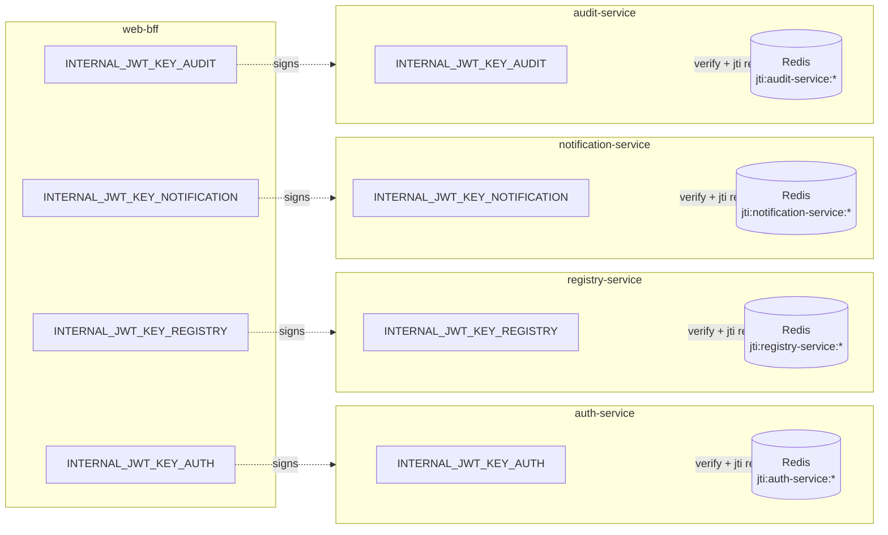
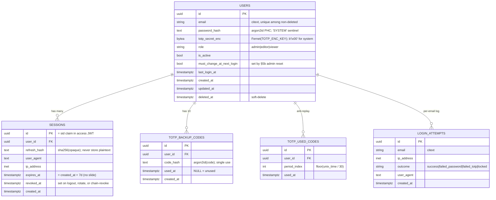

# ADR-0003: Authentication and Session Lifecycle

- **Status**: Accepted
- **Date**: 2026-05-06
- **Accepted on**: 2026-05-06
- **Deciders**: architect (proposed), venawaziwoco83@gmail.com (accepted)
- **Depends on**: ADR-0001 (Tech Stack Selection), ADR-0002 (Service Boundaries and Inter-Service Contracts)
- **References**:
  - OWASP ASVS 4.0 (auth-service is L3; rest of the system L2)
  - NIST 800-63B (TOTP / AAL2)
  - OWASP JWT Cheat Sheet (2024), OWASP Session Management Cheat Sheet
  - RFC 6238 (TOTP), RFC 4226 (HOTP), RFC 7519 (JWT)

## Context

ADR-0001 fixed the cryptographic primitives for authentication (argon2id, pyotp, RS256 access JWT, opaque refresh) and ADR-0002 §E sketched the internal-JWT mechanism for inter-service identity propagation (HS256, 60-second TTL, audience-bound). Neither ADR specified the **lifecycle** controls — enrollment, rotation, lockout, replay protection, multi-tab coordination, recovery — that distinguish a defensible auth subsystem from a checklist of primitives. `the auth feature` is the next planned implementation; without a single normative document, `backend`, `frontend`, and `QA` would each have to assemble the spec from `the security review` (11 sections, R-1..R-9), `the security findings` (16 entries), the project conventions, ADR-0001, and ADR-0002 — and the five user-acceptance decisions made on 2026-05-06 currently live only in chat history. This ADR collapses all of that into one referenceable artifact that backend's PR description will cite as definition-of-done.

The cluster of forces is unusual and pulls the design choices in a non-default direction:

- **Tiny user base, high data sensitivity.** 2–4 specialists in a single department, but the registry holds confidential партнёр-company contracts, licences, and audit reports. Brute-force defences must be strong, but high-friction recovery flows (email-link reset, support-desk processes) cost more than they buy at this scale.
- **On-prem, single host, no SSO, no internet egress from auth.** The product owner explicitly chose "own credential flow + email + TOTP" over Keycloak (ADR-0001 §Auth alternatives). Outbound HTTP from `auth-service` is not available — every check (compromised-password screen, key vending) must work air-gapped.
- **No operational secrets manager day one.** Secrets land via Docker secrets / `.env`; KMS / Vault is deferred to a later ADR. Rotation must be a documented manual procedure, not an unspecified TODO.
- **AAL2 target, ASVS L3 for auth-service.** TOTP is mandatory for all roles per the project conventions #8. The threat model treats every actor as if they were on the public internet (assumption A-1) — defence in depth, not VPN-only-trust.

The trigger for this decision is the security's verdict in `the security findings` §Notes: **FIX-BEFORE-FEATURE-AUTH** — F-001..F-005 (all High) must be decided / ticketed before backend starts coding `the auth feature`. ADR-0003 is the place that decides them. Specifically unresolved after ADR-0001 and ADR-0002:

1. Internal-JWT keying strategy (single shared HS256 secret? per-target keys? RS256?) — F-002.
2. Internal-JWT secret minimum length, replay protection, `nbf` / leeway — F-001, F-003, F-004.
3. Per-user (per-email) lockout policy thresholds — F-005.
4. TOTP enrollment, recovery (backup codes), and admin-reset flow — F-007.
5. Password policy, breached-password screening — F-006.
6. Multi-tab refresh-token rotation behaviour (R-7a in `the security review`).
7. Forgotten-password flow (admin-only vs self-service email link).

These seven items are decided, declaratively and per subsystem, in the section below. Each subsection cites the corresponding `the security review` anchor for evidence and rejected alternatives so that this ADR remains the **normative entry point** without duplicating the review's prose.

## Decision

We adopt the following authentication and session-lifecycle design. All fourteen subsections are binding for `the auth feature` implementation; deviations require a new ADR that supersedes the affected subsection.

### 1. Password storage

Passwords are stored as `argon2id` PHC strings via `argon2-cffi` with parameters `time_cost=3`, `memory_cost=65536` (64 MiB), `parallelism=4`, `hash_len=32`, `salt_len=16`. The verifier is a module-level singleton `argon2.PasswordHasher(...)` in `auth_service.infrastructure.password`. On every successful login, `check_needs_rehash` is consulted and the stored hash is upgraded if the parameters have moved on.

Two short-circuit reject paths run **before** any argon2 call to prevent verifying against a synthetic value:

- `password_hash == 'SYSTEM'` (the system-actor sentinel seeded by `services/auth-service/alembic/versions/0002_seed_system_actors.py`) — hard reject, with a small constant-time delay (`time.sleep(small_random())`) to avoid revealing existence-or-not via timing.
- `is_active == False` — same treatment.


### 2. Password policy

NIST 800-63B 5.1.1.2-aligned. Minimum length 12, maximum length 1024 (DoS guard for argon2 input), **no composition rules**, **no periodic rotation**. Paste is allowed (password-manager support). On `set` and `change`, the password is screened against a locally-bundled HIBP top-1M SHA-1 list shipped with the `auth-service` image (no outbound network call — the threat model forbids egress from auth). Rejection on match is hard; the UX surface ("appears in known breaches") is owned by `design`.

Validation is enforced in **two** places: zod (`z.string().min(12).max(1024)`) on the SPA, Pydantic (`Field(min_length=12, max_length=1024)`) in `auth-service`. The HIBP screen runs only server-side.

Closes F-006. 

### 3. TOTP enrollment

RFC 6238 TOTP, **SHA-1 / 6-digit / 30-second period** (the interop default for Google Authenticator, FreeOTP, Aegis). Secret generation: 160-bit random from `secrets.token_bytes(20)` (RFC 4226 minimum). Server returns the `otpauth://...` URL; the QR code is rendered **client-side** to keep the secret out of CDN/proxy caches and off the backend's dependency surface.

Enrollment is a **two-step flow**:

1. `POST /api/v1/totp/enroll` → returns `{secret_b32, otpauth_url}` and stores the secret in a **pending Redis key with 5-minute TTL**, keyed by `user_id`. The `auth.users.totp_secret_enc` column is **not** updated yet.
2. `POST /api/v1/totp/enroll/confirm {code}` → verifies the code against the pending secret; on success, encrypts and writes to `totp_secret_enc`, deletes the pending Redis key.

A user with `totp_secret_enc = b'\x00'` (the system-actor sentinel) cannot log in. A non-system user without TOTP is forced into enrollment on first login via a one-time password issued out-of-band by an admin (see §5).


### 4. TOTP verification

`pyotp.TOTP(secret).verify(code, valid_window=1)` — accept current ± 1 step (90-second tolerance for clock drift). NIST permits ±1 step at AAL2.

Anti-replay is enforced in `auth.totp_used_codes (user_id, code, used_at)` with a row-level uniqueness on `(user_id, period_index)` where `period_index = floor(unix_time / 30)`. A code accepted within the validity window cannot be reused, even within those 90 seconds.

Per-email rate limit: 5 failed TOTP in 15 min → 15-min lockout (this is the same counter as §12 below — failures across factors are combined).


### 5. TOTP recovery: backup codes and admin reset

**Backup codes** (user-self-recovery path):

- Exactly **10 single-use codes** generated at TOTP enrollment.
- Format `4-4` hex with separator (e.g., `A1B2-C3D4`) — 8 hex digits, easy to read aloud, hard to mis-type.
- Displayed **once**, immediately after enrollment confirmation.
- Stored as `argon2id` hashes in `auth.totp_backup_codes (user_id, code_hash, used_at)`.
- Use of a backup code is equivalent to TOTP for one login; the row's `used_at` is set.
- Warn at ≤2 unused codes remaining; force regeneration at 0 (regeneration invalidates all prior codes).

**Admin reset** (administrative recovery path, also used for forgotten passwords — see §5b):

1. Admin POSTs `/api/v1/users/{id}/totp/reset` with **their own** current TOTP code (re-MFA, ASVS V2.7.5).
2. System sets `auth.users.totp_secret_enc = b'\x00'`, revokes all sessions of the target user.
3. Emits `auth.user.totp_reset.v1` (audit), `actor_id = admin_id`, `target_id = user_id`.
4. Target user must re-enroll TOTP on next login, using a one-time password issued out-of-band (channel chosen by admin — Telegram bot DM or in-person).

#### 5b. Forgotten-password flow

**Admin-only password reset.** No self-service email-link flow exists. The flow is identical to TOTP-reset above:

1. Admin POSTs `/api/v1/users/{id}/password/reset` with their own current TOTP code (re-MFA).
2. System generates a one-time password (OTP), stores its argon2id hash with `must_change_at_next_login = true`, revokes all sessions of the target user.
3. Emits `auth.user.password_reset.v1` (audit, severity=info), `actor_id = admin_id`, `target_id = user_id`.
4. Admin delivers the OTP to the user **out-of-band** (delivery channel chosen by admin — likely Telegram bot DM or in-person).
5. The user logs in with the OTP, which grants access **only** to `POST /api/v1/auth/password/change`. Every other API call returns 403 with `WWW-Authenticate: must_change_password` until the change is completed.

Rationale for admin-only: at 2–4 users a self-service email-link flow opens a phishing surface (lookalike-domain "reset your password" emails) without measurable benefit. Operational cost is acceptable at this scale and explicitly revisited if user count exceeds 50 (see Consequences).

Closes F-007. 

### 6. TOTP secret encryption at rest

**Fernet** (`cryptography.fernet.Fernet`, AES-128-CBC + HMAC-SHA256) with master key from the `TOTP_ENC_KEY` env var (already enumerated in `infra/secrets-dev/README.md`). The DB column `auth.users.totp_secret_enc` is `bytea`; the value is the Fernet token bytes. Encrypt on enrollment confirmation, decrypt only at verify time, **never log the decrypted secret**. The wrapper lives in `auth_service.infrastructure.totp_crypto`.

Key rotation is a documented manual procedure: a maintenance script decrypts each TOTP secret with the old key and re-encrypts with the new key, in a single transaction per user. Procedure documented in `docs/architecture/secrets.md` (ops follow-up).

External KMS / Vault is **deferred** — see Consequences and ADR-0007 (proposed).


### 7. External access JWT

- **Algorithm**: RS256 (asymmetric — auth-service signs with private key, BFF and any future verifier validates with public key). Per ADR-0001.
- **TTL**: 15 minutes hard cap, no extension.
- **Header**: includes `kid` to support rotation (verifier tolerates the previous public key for one TTL window).
- **Claims**: `iss="lotsman-auth"`, `aud="lotsman-spa"`, `sub` (user UUID string), `email` (lowercased), `role` (`admin|editor|viewer`), `iat`, `exp`, `nbf`, `jti` (UUIDv4), `sid` (opaque session id linked to `auth.sessions.id` for forced-revocation propagation per §13).
- **Verification (in BFF)**:
  ```python
  jwt.decode(
      token, public_key,
      algorithms=["RS256"],
      audience="lotsman-spa",
      issuer="lotsman-auth",
      options={"require": ["exp", "iat", "nbf", "sub", "aud", "iss", "jti", "sid", "role"]},
      leeway=2,
  )
  ```
- **Algorithm-confusion defence**: `algorithms=["RS256"]` is **always** passed as a list — never accept the token's `alg` header. This is grep-enforced in CI.
- **Key storage**: PEM files at `JWT_PRIVATE_KEY_PATH` / `JWT_PUBLIC_KEY_PATH`. Mounted as Docker secrets, file mode `0400`. Private key mounted **only** into `auth-service`; public key mounted into BFF (and any future verifier).
- **Rotation**: 90 days (per the project conventions). Implementation: `kid` rollover; auth-service signs with current key while BFF tolerates the previous public key for one TTL window.


### 8. External refresh token

- **Format**: 256-bit random opaque string (`secrets.token_urlsafe(32)`). **Not a JWT** — opacity enables instant server-side revocation.
- **Storage**: `sha256` hex digest in `auth.sessions.refresh_hash` (already modeled in `services/auth-service/src/auth_service/db/models.py:127-131`). The plaintext token never leaves the response that issued it; never persisted.
- **TTL**: 7 days **absolute**. No sliding extension — forces re-login weekly even for active users.
- **Rotation on every use**:
  1. Client sends current refresh cookie to `POST /api/v1/auth/refresh`.
  2. `auth-service`: `SELECT * FROM auth.sessions WHERE refresh_hash = sha256(received) AND revoked_at IS NULL AND expires_at > now()`. If no row, hard 401 + audit anomaly.
  3. **Reuse detection**: if a row matching `refresh_hash = sha256(received)` exists with `revoked_at IS NOT NULL`, an attacker has used a token after it was rotated. **Revoke the entire session chain** (all sessions for that `user_id` with `revoked_at IS NULL`), return 401, emit `auth.session.reuse_detected.v1` (severity=high).
  4. Otherwise, issue a new refresh + new session row, mark the old session row `revoked_at = now()`, return both new tokens.
- **No grace window** — the BroadcastChannel mechanism in §11 guarantees only one refresh in flight, so reuse-detection stays strict.
- **Logout**: `POST /api/v1/auth/logout` → `UPDATE auth.sessions SET revoked_at=now() WHERE refresh_hash=sha256(received)`, emits `auth.session.revoked.v1`, response `Set-Cookie: refresh=; Max-Age=0`. The access JWT remains valid until `exp` (≤15 min); this gap is documented and accepted (§13).


### 9. Refresh-cookie attributes

The refresh cookie (and **only** the refresh cookie — the access JWT lives in memory) carries:

| Attribute | Value | Why |
|---|---|---|
| `HttpOnly` | yes | JS cannot read it; defends XSS exfiltration |
| `Secure` | yes | HTTPS only |
| `SameSite` | `Strict` | Never sent on cross-site nav; CSRF defence for refresh |
| `Path` | `/api/v1/auth` | Minimise scope — not sent to `/api/v1/documents` etc. |
| `Max-Age` | `604800` (7 days) | Matches absolute refresh TTL |
| `Domain` | (omitted) | Cookie locked to `lotsman.example.com` exactly |

End-to-end test asserts the literal `Set-Cookie` header.


### 10. Internal JWT (per-service HS256 keys)

**Per-service HS256 keys.** The single `INTERNAL_JWT_SECRET` env var defined in the bootstrap commit is **removed**. Four distinct env vars replace it, one per audience:

- `INTERNAL_JWT_KEY_AUTH`
- `INTERNAL_JWT_KEY_REGISTRY`
- `INTERNAL_JWT_KEY_NOTIFICATION`
- `INTERNAL_JWT_KEY_AUDIT`

Distribution:
- **`web-bff`** holds **all four** (it mints tokens for every backend).
- **Each backend service** holds **only its own** (it never mints internal JWTs and never verifies tokens for other audiences).

Each key field carries `Field(..., min_length=32)` in Pydantic Settings; startup fails fast otherwise. Rotation cadence: **quarterly**, manual, documented in `docs/architecture/secrets.md` (ops follow-up).

The hardening recommendations in `the security review` §5 are all adopted alongside the keying change:

| Item | Change to `shared/src/lotsman_shared/internal_jwt.py` |
|---|---|
| **R-5b** (F-001) | `min_length=32` enforced in every service's `config.py` (the four `INTERNAL_JWT_KEY_*` fields above). |
| **R-5c** (F-003) | After `verify_internal_jwt`, every backend's `current_actor` dependency does `redis.set(f"jti:{aud}:{jti}", "1", nx=True, ex=ttl_remaining)`. If `nx` returns false, raise 401 "replay detected". |
| **R-5d** (F-004) | `issue_internal_jwt` adds `payload["nbf"] = int(now.timestamp())`; `verify_internal_jwt` passes `leeway=2` to `jwt.decode`. |
| **R-5e** | Post-decode dataclass construction wrapped in `try/except` re-raising as `jwt.InvalidTokenError("malformed claim shape")`; callers tighten `except Exception` to `except jwt.InvalidTokenError`. |
| **R-5f** | Drop the `isinstance(decoded["aud"], str)` shim — PyJWT has already validated `aud == expected_audience`. |
| **R-5g** | Startup warning if any `INTERNAL_JWT_KEY_*` value equals any other env-loaded secret (dev); reject in prod. |

Other invariants of the internal JWT (unchanged from ADR-0002 §E):

- TTL: 60 seconds, not refreshed.
- Issuer: `"web-bff"` (only the BFF mints).
- Audience: target service name, **strictly** validated.
- Algorithm pinned at HS256 in code, passed explicitly to `decode(..., algorithms=["HS256"], ...)`.
- Required claims: `["exp", "iat", "nbf", "sub", "aud", "iss", "jti", "role"]`.

Closes F-001, F-002, F-003, F-004. 

### 11. Multi-tab token coordination

**`BroadcastChannel('lotsman-auth')`** in the SPA. One leader-elected tab performs the refresh; the other tabs receive the new access token via the channel. This guarantees a single refresh in flight at any time — which is why §8 rotation reuse-detection stays strict (no grace window).

Implementation owner: `frontend`. The leader-election + broadcast contract is the SPA's responsibility; the backend has no special multi-tab logic.

Tests:
- E2E (Playwright): two tabs open, only one `POST /api/v1/auth/refresh` is observed across the test window; both tabs end up with the same fresh access token.
- E2E: if the leader tab is closed, a follower is elected and the next refresh succeeds.


### 12. Login-attempt and lockout policy

Driven by `auth.login_attempts` (already modeled in `services/auth-service/src/auth_service/db/models.py:153-188`). Counters are **per email**, not per IP (per-IP is already covered at Nginx — `5/min` on `/login`).

- **5 failed (password OR TOTP) within 15 min** → 15-min lockout for that email.
- **10 failed within 60 min** → 24-hour lockout for that email + emit `auth.account.locked.v1` (severity=high; admin alert).
- **Successful login resets the counter** — prior failures within the window are deleted/ignored.
- The `failed (password OR TOTP)` count **combines** both factors. A determined attacker cannot spread failures across factors to extend the budget.
- The 401 response is **generic** ("Invalid credentials") regardless of the underlying cause — wrong password, wrong TOTP, locked account, deactivated account, non-existent email. No enumeration. The audit log records the actual outcome (`failed_password` / `failed_totp` / `locked` / `success`).

Implementation:
- Use case `CheckLockout` reads the count in the same transaction that runs the verify — locked emails short-circuit before argon2 is invoked.
- Use case `RecordLoginAttempt` writes the row in the same transaction as the verify result.
- Index `(email, created_at, outcome)` is added in the migration (partial — only for the failure outcomes).

Closes F-005. 

### 13. Session revocation surface

Day-one design accepts the **15-minute lingering window** of access JWTs after a refresh-token revocation:

- `POST /api/v1/auth/sessions/{id}/revoke` (admin or self) — revoke a specific session.
- `POST /api/v1/auth/users/{id}/revoke-all-sessions` (admin only, audited) — revoke all of a user's sessions.
- `POST /api/v1/auth/users/{id}/lockout` (admin only, audited) — adds the user's id to a `locked-users` Redis SET; **the BFF checks `SISMEMBER locked-users <sub>` on every request** — instant kill-switch, even before per-`sid` revocation infra exists.

Per-`sid` revocation (one Redis round-trip per request to check `SISMEMBER revoked-sessions <sid>`) is **deferred to ADR-0006**. The 15-minute window is acceptable at our scale; the `lockout` flag covers high-severity admin overrides today.

The 15-minute lingering window is documented in `docs/architecture/auth.md` (Documentation follow-up).


### 14. Authorization headers and CSRF

- **State-changing routes** (POST/PUT/PATCH/DELETE) MUST require `Authorization: Bearer <access_jwt>`. Reject if missing — even if a refresh cookie is present. This breaks the CSRF chain because cross-site script cannot read the access token from JS to set the header (refresh cookie alone is not enough to mutate state).
- **Refresh cookie** is `SameSite=Strict` (per §9), which blocks the textbook CSRF for the refresh endpoint itself.
- Any **future cookie-only endpoint** (e.g., a download link `<a href=...>` that streams a file) MUST use a **double-submit CSRF token**: server sets a non-`HttpOnly` `csrf` cookie; client reads it via JS and echoes it in `X-CSRF-Token`; server compares. The helper middleware lives in `web-bff` from day one even if no route consumes it yet.

Long-running synchronous endpoints (anything that could exceed 30 seconds) are forbidden in this design. All long jobs return `202 Accepted` with a job id and are polled by the SPA — the poll endpoint is short and survives a refresh boundary cleanly.

Frontend:
- A top-level `<AuthGuard>` in the SPA redirects to `/login` on any 401 from a private route.
- A global TanStack Query 401 interceptor clears all queries and redirects to `/login`.


## Consequences

### Positive

- **Closes F-001, F-002, F-003, F-004, F-005** — every High-severity finding from the 2026-05-06 baseline scan that blocks `the auth feature` is decided here. Once backend's PR lands, security flips them to `Fixed in <commit>` in `the security findings`.
- **Unambiguous spec for downstream agents.** `backend`, `frontend`, and `QA` now have one authoritative document; there is no need to cross-read 5 prior artifacts.
- **NIST 800-63B AAL2 conformance.** TOTP enrollment + verification + recovery + lockout policy align with 800-63B 5.1.5 thresholds.
- **OWASP ASVS 4.0 L3 conformance for auth-service** on V2 (auth), V3 (sessions), V14.5 (service comms) controls — explicit alg pinning, audience binding, replay cache, rotation-on-use, reuse detection.
- **Defence in depth at the internal-JWT layer.** Per-service keys + replay cache + nbf + leeway means a single compromised container does not yield mesh-wide forgery; F-002's blast radius shrinks from "all backends" to "the one backend that holds the key".
- **Strict reuse-detection without breaking multi-tab UX.** BroadcastChannel guarantees a single refresh in flight, which is what allows §8 to omit the grace window — a cleaner contract than the alternative of "accept the previous refresh hash for ~30s".
- **Minimal external dependency surface.** No SSO, no email-reset workflow, no KMS day one — every control runs on the four containers + Postgres + Redis already specified in ADR-0001/ADR-0002.

### Negative

- **Four extra Docker secrets** to provision and rotate (`INTERNAL_JWT_KEY_{AUTH,REGISTRY,NOTIFICATION,AUDIT}`) instead of one. Operational cost: ~5 minutes per quarterly rotation, scripted.
- **Quarterly key-rotation cadence** is a recurring manual operation until a secrets manager (Vault) is introduced — see ADR-0007 (proposed).
- **HIBP top-1M dataset bundled in the auth-service image** — adds ~25 MB to the image; rebuilt-quarterly to refresh the list. Acceptable; alternative (HIBP API range query) violates the no-egress constraint on auth.
- **Admin-only password reset is operationally heavy at scale.** At 4 users it is a non-event (resets per year measured in single digits); at 50+ users the admin would become a help-desk. Trigger to revisit: more than 1 reset/week sustained, or user count exceeds 50. Captured as a follow-up condition.
- **15-minute lingering access** after a refresh-token revoke is accepted day one. Mitigated by the admin `lockout` Redis flag for high-severity cases. Per-`sid` Redis check on every request is deferred to ADR-0006.
- **Internal JWT remains HS256.** A future migration to RS256 (with `kid` rollover) is enabled by §10's per-key structure but not performed today — see Alternatives.

### Neutral / follow-ups

- **ADR-0005 — Internal mTLS / service mesh** (already planned). When mTLS lands, the internal JWT stays — mTLS authenticates the **caller container**, the internal JWT authenticates the **acting human**.
- **ADR-0006 — Per-sid instant session revocation via Redis SET.** Trigger: user count > 20, or compliance demand for sub-minute revocation.
- **ADR-0007 — Secrets management / Vault.** Trigger: total on-prem secret count exceeds ~20 (we are at ~12 today; adding the four `INTERNAL_JWT_KEY_*` brings us to 16).
- **`docs/architecture/secrets.md`** — ops must create this document, covering rotation procedures for: RS256 keypair (90 days), four `INTERNAL_JWT_KEY_*` (quarterly), `TOTP_ENC_KEY` Fernet master (re-encrypt-all migration), per-service Postgres role passwords (quarterly per F-013).
- **`docs/architecture/auth.md`** — Documentation must document the 15-minute lingering-access window and the multi-tab BroadcastChannel design for operations runbook.
- **OpenAPI surface for `/api/v1/auth/*`** — backend produces; checked into `docs/api/auth.yaml` per ADR-0002 invariant 7.
- **F-008 (BFF inbound header sanitisation)** is implementation-time scope inside `the auth feature` even though it is not a Decision in this ADR — backend's checklist includes it.
- **F-009 (structlog redaction processor)** — same; closed by `the auth feature` PR.

## Alternatives considered

### Option A — Single shared internal-JWT secret (the bootstrap-commit design)

Continue with one `INTERNAL_JWT_SECRET` shared by all five containers; rely entirely on the `aud` claim for per-target isolation.

- **Pro**: One secret to manage; one rotation event per quarter.
- **Pro**: The current `internal_jwt.py` already validates `aud` correctly — no change needed.
- **Con**: Compromise of any one container that holds the secret + a single forged token with a different `aud` claim = mesh-wide authentication bypass. The blast radius is "all four backends".
- **Con**: F-002 (High) remains Open.
- **Why rejected**: The cost of going from one to four secrets at our scale is trivial (≤5 min/rotation, all scripted in `docs/architecture/secrets.md`); the security gain (blast-radius reduction from 4 services to 1) is large. Single-key would be defensible at much smaller blast radius (e.g., one writer, one reader); we have a star with 5 nodes.

### Option B — RS256 internal JWT day one

Migrate internal-JWT signing to RS256: BFF holds a private key; each backend holds the public key (via JWKS endpoint or static PEM mount).

- **Pro**: Asymmetric — backends cannot forge tokens for each other (they only have the public key).
- **Pro**: Aligns with the external JWT cryptographic story (RS256 + `kid` rollover).
- **Pro**: A future "auth-service mints internal JWTs" pivot is easier.
- **Con**: Requires a key-distribution mechanism (JWKS endpoint or another mounted secret) — more moving parts at single-host scale.
- **Con**: HS256 verification is faster at our request volume (negligible, but real); RS256 adds ~0.5ms/verify on the BFF→backend hot path.
- **Con**: Per-target HS256 keys already deliver the "compromise of one backend doesn't give cross-mesh forgery" property — RS256's marginal benefit at single-host scale is small.
- **Why rejected**: Marginal benefit relative to per-target HS256, more operational complexity (JWKS endpoint or extra secret distribution). Reserve for a future ADR if we move multi-host (paired with ADR-0005 mTLS).

### Option C — Self-service password reset via email link

Standard "forgot password" flow: user enters email, system mails a one-time signed link, user clicks, sets new password.

- **Pro**: Zero admin intervention; familiar UX.
- **Con**: Adds an outbound email path on the **authentication** boundary (currently `auth-service` does no egress) — widens blast radius.
- **Con**: At 4 users, the phishing surface (lookalike-domain "reset your password" emails) is meaningfully larger than the convenience benefit.
- **Con**: Requires either an email-link signing key (another secret) or a database-backed token + cleanup worker.
- **Con**: Email is also our notification channel — coupling the recovery story to the same provider creates a single point of compromise.
- **Why rejected**: Unjustifiable cost-benefit at 4 users on-prem. Revisit if user count exceeds 50 (Consequences).

### Option D — Full SSO via Keycloak (or similar)

Deploy Keycloak alongside Лоцман; delegate all authentication and TOTP enrollment.

- **Pro**: Battle-tested IdP; out-of-the-box account recovery, TOTP, MFA, audit.
- **Pro**: A trivial path to corporate SSO if it ever lands.
- **Con**: Already explicitly rejected in ADR-0001 §Auth alternatives — the product owner chose "own login + email + TOTP" precisely to avoid Keycloak's operational footprint.
- **Con**: Adds a Java runtime, a separate Postgres for Keycloak, and another rotation surface.
- **Why rejected**: Out of scope by ADR-0001. Re-revisit only if a corporate SSO mandate appears.

### Option E — bcrypt or scrypt for password hashing

Replace argon2id with bcrypt (work-factor cost) or scrypt (memory-hard, older).

- **Pro (bcrypt)**: Universally available; zero ops surprises.
- **Pro (scrypt)**: Memory-hard; weaker than argon2id but acceptable.
- **Con (bcrypt)**: 72-byte input cap; slower-evolving tunability than argon2id; OWASP and ASVS prefer argon2id when available.
- **Con (scrypt)**: Less memory-hard than argon2id at the same RAM budget; less standardised parameter guidance.

### Option F — "First tab wins, others get logged out" instead of BroadcastChannel

Skip the multi-tab coordination layer; whichever tab refreshes first invalidates the others, who then re-login.

- **Pro**: Simplest possible frontend implementation.
- **Pro**: Forces the user to consolidate tabs (arguably good operational hygiene).
- **Con**: A user with two tabs (e.g., main app + audit-log viewer) loses one tab unexpectedly every 7 days.
- **Con**: Conflates "tab refresh" with "credential rotation" in the user's mental model — confusing.
- **Why rejected**: BroadcastChannel is a 50-line frontend addition with broad browser support (all our supported browsers per `docs/architecture/browser-support.md` to be written by frontend) and removes a recurring papercut.

## Architecture diagrams

### Sequence: login with TOTP, internal-JWT minting, replay rejection

```mermaid
sequenceDiagram
    autonumber
    actor U as User
    participant N as Nginx
    participant B as web-bff
    participant A as auth-service
    participant R as Redis
    participant P as Postgres (auth)

    U->>N: POST /api/v1/auth/login {email, password}
    N->>N: rate-limit zone=login (5/min/IP)
    N->>B: forward
    B->>B: mint internal JWT (key=AUTH, aud=auth-service, ttl=60s, jti, nbf)
    B->>A: POST /api/v1/auth/login (X-Internal-Token)
    A->>A: verify_internal_jwt(secret=KEY_AUTH, expected_audience='auth-service', leeway=2)
    A->>R: SET nx jti:auth-service:<jti> (ex=ttl_remaining)
    alt jti already in Redis
        A-->>B: 401 (replay detected)
        B-->>U: 401 (generic)
    else fresh jti
        A->>P: CheckLockout(email)  -- §12
        alt locked
            A-->>B: 401 (generic — no enumeration)
        else not locked
            A->>P: SELECT user; reject if password_hash='SYSTEM' or is_active=false
            A->>A: argon2id verify(password, hash); check_needs_rehash → maybe re-hash
            A->>P: INSERT INTO auth.login_attempts (outcome=...)
            alt password ok
                A->>R: SET totp:pending:<opaque-id> {user_id} ex=300
                A-->>B: 200 {totp_session_token}
                B-->>U: 200 {totp_required}
                U->>B: POST /api/v1/auth/totp/verify {session, code}
                B->>A: POST /api/v1/auth/totp/verify (X-Internal-Token)
                A->>P: SELECT totp_secret_enc → Fernet decrypt
                A->>A: pyotp.TOTP(secret).verify(code, valid_window=1)
                A->>P: anti-replay: insert into auth.totp_used_codes (user_id, period_index)
                A->>P: INSERT INTO auth.sessions (refresh_hash=sha256(opaque), expires_at=+7d)
                A->>P: INSERT INTO auth.outbox (auth.user.logged_in.v1)
                A->>A: mint access JWT (RS256, kid, sid, 15m)
                A-->>B: 200 {access_jwt, refresh_opaque}
                B-->>U: 200 access_jwt + Set-Cookie refresh=...; HttpOnly; Secure; SameSite=Strict; Path=/api/v1/auth
            else password bad
                A-->>B: 401 (generic)
            end
        end
    end
```

### Sequence: refresh-token rotation with reuse-detection chain-revoke

```mermaid
sequenceDiagram
    autonumber
    actor U as User
    participant B as web-bff
    participant A as auth-service
    participant P as Postgres (auth)
    participant Q as Redis Streams

    U->>B: POST /api/v1/auth/refresh (cookie: refresh=<opaque>)
    B->>A: POST /api/v1/auth/refresh (X-Internal-Token aud=auth)
    A->>P: SELECT * FROM auth.sessions WHERE refresh_hash = sha256(received)
    alt no row matches
        A-->>B: 401 (audit anomaly)
    else row matches AND revoked_at IS NULL AND not expired
        A->>P: BEGIN
        A->>P: INSERT new auth.sessions row (new refresh_hash, expires_at = +7d)
        A->>P: UPDATE old auth.sessions SET revoked_at = now()
        A->>P: COMMIT
        A->>A: mint new access JWT (15m, sid=<new>)
        A-->>B: 200 {access_jwt, new_refresh_opaque}
        B-->>U: 200 access + Set-Cookie new refresh
    else row matches AND revoked_at IS NOT NULL  -- REUSE
        A->>P: UPDATE auth.sessions SET revoked_at=now() WHERE user_id = <sub> AND revoked_at IS NULL
        A->>P: INSERT INTO auth.outbox (auth.session.reuse_detected.v1, severity=high)
        A-->>B: 401
        Note over A,Q: chain revoked; admin alerted via audit dashboard
    end
```

### Component: per-service internal-JWT keys (Decision §10)



### ER: tables touched by this ADR



### 13. Amendment 2026-05-12 — configurable TTL and cookie attributes; BFF refresh coalescing

**Trigger**: users reported frequent involuntary logouts. Root cause was a two-part false positive:

1. **Multi-request race at the BFF layer.** The SPA fires several parallel API calls; each receives 401 (expired access token); each independently initiates `POST /api/v1/auth/refresh`. Auth-service's chain-revocation (§8) is correct security behaviour for a genuine replay attack, but triggers as a false positive when N concurrent requests carry the same refresh cookie. The BroadcastChannel leader election (§11) gates `refresh()` calls **initiated by the scheduler**, but not the ones triggered by concurrent 401 interceptions.

2. **`Secure=true` cookie dropped on HTTP localhost.** Browsers silently discard `Secure`-flagged cookies on non-HTTPS origins, so the refresh cookie never persists in dev, causing every page load to 401.

**Resolution**:

**BFF-side refresh coalescing** (`services/web-bff/src/web_bff/api/v1/auth.py`):

- `POST /api/v1/auth/refresh` now holds a per-cookie-hash async mutex + a 5-second in-process result cache keyed by `sha256(cookie_value)`.
- The first concurrent request with a given cookie acquires the lock, calls upstream once, stores `(timestamp, body, set-cookie-headers)` in `_refresh_cache`, releases lock.
- Subsequent requests with the same cookie wait on the lock; on acquire, read from cache and return the same response without touching upstream.
- Cache entries expire after 5 s (lazy eviction). After that, a genuine retry goes through normally.
- This is in-process only (single BFF instance). Horizontal scaling would require Redis-based distributed coalescing (e.g., Redlock); document in ops runbook if BFF is ever scaled out.

**Configurable TTL** (env vars, both auth-svc and web-bff):

| Var | Default | Range |
|---|---|---|
| `ACCESS_TOKEN_TTL_SECONDS` | 900 (15 min) | 60–3600 |
| `REFRESH_TOKEN_TTL_SECONDS` | 43200 (12 h) | 3600–2592000 |

Previous refresh TTL was 7 days (604800 s). Changed to 12 h per user request 2026-05-12. Hard-TTL model retained (no sliding session). Existing sessions keep their original `expires_at`; they expire naturally at 7 d from creation and cycle to the new 12-h TTL on next full login.

**Configurable refresh-cookie security attributes**:

| Var | Prod | Dev |
|---|---|---|
| `REFRESH_COOKIE_SECURE` | `true` | `false` |
| `REFRESH_COOKIE_SAMESITE` | `strict` | `lax` |

Dev-friendly defaults are set in `infra/compose.dev.yml`. Production `.env` must set `REFRESH_COOKIE_SECURE=true` and `REFRESH_COOKIE_SAMESITE=strict`.

`web-bff` inherits the same four cookie-attribute env vars so its `_set_refresh_cookie` function matches auth-service's cookie attributes.

**No changes to**:
- Session chain-revocation logic (remains strict — correct for genuine replay attacks).
- BroadcastChannel leader election on the frontend (remains the primary multi-tab guard for scheduler-initiated refreshes; BFF coalescing covers the Promise.all interception race).
- Sliding session (still not implemented — hard TTL only).

## Implementation handoff

### `Product`
- Produce user stories for `the auth feature` based on this ADR. At minimum:
  - "As a new user, I enroll in TOTP on first login and receive 10 backup codes."
  - "As an admin, I reset another user's TOTP/password using my own current TOTP code; the target user's sessions are immediately revoked."
  - "As an editor with two open tabs, my refresh happens once and both tabs continue working."
  - "As an attacker replaying a captured refresh token, the entire session chain is revoked and an audit event is emitted."
- Each story includes Gherkin AC that maps 1-to-1 to a `QA` test.

### `backend`
Work the action-item checklists in `the security review` exactly as written: §1 (password), §2 (policy), §3 (TOTP enroll/verify/recovery + Fernet), §4 (external JWT + refresh + cookie), §5 (internal JWT — replacing the **single** `INTERNAL_JWT_SECRET` with the **four** `INTERNAL_JWT_KEY_*` per §10 of this ADR), §6 (revocation endpoints + lockout Redis flag), §7c (long-jobs are async), §8 (state-changing routes require `Authorization: Bearer`), §9 (lockout policy thresholds 5/15-min and 10/60-min). Additionally:
- Wire F-008 (BFF inbound `X-Internal-Token` sanitiser middleware) and F-009 (structlog redaction processor) inside the `the auth feature` PR.
- Update `shared/src/lotsman_shared/internal_jwt.py` per §10's R-5b..R-5g hardening table.
- Migrations: add `auth.totp_backup_codes`, `auth.totp_used_codes`, partial index on `auth.login_attempts (email, created_at, outcome)` for failure outcomes, `auth.users.must_change_at_next_login` boolean.
- Outbox events to emit: `auth.user.logged_in.v1`, `auth.user.logged_out.v1`, `auth.session.revoked.v1`, `auth.session.reuse_detected.v1` (severity=high), `auth.user.totp_reset.v1`, `auth.user.password_reset.v1`, `auth.account.locked.v1` (severity=high).

### `frontend`
- Implement `BroadcastChannel('lotsman-auth')` with leader election; only the leader tab calls `POST /api/v1/auth/refresh`; followers receive the new access token via the channel. Cover with a Playwright multi-tab test.
- Implement a global TanStack Query 401 interceptor: clear all queries, redirect to `/login`.
- Implement a top-level `<AuthGuard>` redirecting to `/login` when no fresh access token is in memory.
- Implement the login form (email + password → TOTP step), TOTP enrollment screen (QR + 10 backup codes shown ONCE with copy-to-clipboard + "I have saved these" confirmation), backup-code login fallback, and the must-change-password screen (forced after admin password reset).
- zod password schema: `z.string().min(12).max(1024)`. Surface a non-blocking hint when the server flags HIBP membership.

### `ops`
- Replace `INTERNAL_JWT_SECRET` in `.env.example` and `infra/compose.dev.yml` with the four `INTERNAL_JWT_KEY_*` env vars per §10 above. BFF gets all four; each backend gets only its own.
- Generate strong values: `python -c "import secrets; print(secrets.token_hex(32))"` per key. Document in `infra/secrets-dev/README.md`.
- Create `docs/architecture/secrets.md` covering rotation procedures for: RS256 keypair (90 days, `kid` rollover), four `INTERNAL_JWT_KEY_*` (quarterly), `TOTP_ENC_KEY` Fernet master (re-encrypt-all migration script), per-service Postgres role passwords (quarterly per F-013).
- Configure Redis `requirepass` and per-service ACL users (closes F-012 in parallel).
- Verify NTP/chrony is running on the host (supports F-004's `leeway=2` assumption).

### `QA`
- Every Gherkin AC from Product maps to a test (unit/integration/e2e as appropriate). Specifically:
  - **Lockout**: 5 failed attempts in 15 min → 15-min lockout for that email; success resets counter.
  - **Refresh reuse-detection chain-revoke**: replay a rotated refresh token → all user sessions revoked + `auth.session.reuse_detected.v1` audit event emitted.
  - **Internal-JWT replay rejection**: capture a valid internal JWT, replay within 60 s → second request returns 401.
  - **Internal-JWT audience mismatch**: an internal JWT minted for `registry-service` is REJECTED at `notification-service`.
  - **Internal-JWT `min_length=32`**: starting any service with `INTERNAL_JWT_KEY_X` shorter than 32 chars fails fast.
  - **Generic 401**: wrong password, wrong TOTP, locked account, deactivated account, non-existent email all return identical response bodies.
  - **TOTP replay**: same TOTP code in same period_index → second attempt rejected.
  - **Cookie attributes**: end-to-end test asserts the literal `Set-Cookie` header for the refresh cookie.
  - **Multi-tab Playwright**: 2 tabs, only one `/refresh` observed.
  - **Forced password change**: after admin reset, every API call except `POST /api/v1/auth/password/change` returns 403 `WWW-Authenticate: must_change_password`.
- Property tests (hypothesis): `verify(hash(p), p) == True` for arbitrary unicode `p`, length 12..256.

### `security`
- ADR-0003 closes **F-001, F-002, F-003, F-004, F-005** in `the security findings` once backend's `the auth feature` PR lands and the QA matrix above passes. Until then, those findings remain `Open` with a comment "decided in ADR-0003, awaiting implementation".
- Re-audit auth subsystem against OWASP ASVS L3 after `the auth feature` ships, per `the threat model` §8.

### `Documentation`
- Create `docs/architecture/auth.md` documenting (a) the 15-minute lingering-access window, (b) the BroadcastChannel multi-tab design, (c) the admin-reset OOB-OTP delivery procedure (operator runbook).
- Document the `/api/v1/auth/*` surface in `docs/api/auth.yaml` (generated from FastAPI; verify 1-to-1 with this ADR).

### Out of scope for this ADR (deliberately deferred)
- Per-`sid` instant session revocation (Redis SET checked on every request) → ADR-0006.
- mTLS between services → ADR-0005.
- Vault / KMS for secret distribution → ADR-0007 (proposed, trigger: secret count > 20).
- Self-service password reset → revisit when user count > 50.
- RS256 internal JWT migration → revisit alongside ADR-0005.
